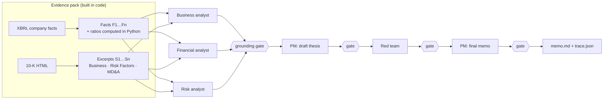

# due-diligence-agent

**A team of AI analysts that reads a company's 10-K and writes an investment memo, and is structurally prevented from making things up.**

```bash
ddagent NVDA COST ANET   # → memos/NVDA.md, memos/COST.md, memos/ANET.md
```

Three specialist agents analyze the filing. A red-team agent then attacks their thesis, and a portfolio-manager agent writes the final memo, which covers the thesis, the bull and bear cases, diligence questions, and a triage verdict. Every claim in the memo cites the evidence behind it, and **code rather than a prompt checks every citation and every number before the claim can move on to the next agent.**

> Research triage, not investment advice.

## Why this exists

LLMs are good at reading filings and bad at being trusted with them. A memo that reads fluently but has a wrong margin or an invented market-share figure is worse than no memo at all. The standard fix is to tell the model not to hallucinate, and that doesn't hold up in practice. This project goes the other way: **the model can only say things it can point to, and a deterministic gate checks that it did.**

## How it works



1. **Evidence pack.** `edgar.py` pulls the latest 10-K and the XBRL company facts from SEC EDGAR's free APIs. `evidence.py` selects clean annual values (it drops the quarterly rows a 10-K also restates, keeps the latest restatement, and handles companies that switch XBRL tags over time), then computes margins, growth, CAGR, FCF, net debt and dilution **in Python**, never in the model. `filing.py` extracts the Business, Risk Factors and MD&A sections. It has to skip the table of contents, which repeats every heading, and it chunks each section into verbatim excerpts.
2. **Specialists work in parallel.** Each analyst sees only its slice of the evidence and has to return JSON claims with citations.
3. **The grounding gate** (`verify.py`) checks every claim in three ways. First, the claim must cite at least one id, and every id it cites must exist. Second, **every number in the text must trace to one of the cited items.** For a fact, that means it matches the fact's value within rounding tolerance and with unit scaling ($1.2B = $1,200 million). For an excerpt, the number has to appear verbatim. Third, a number that's true but cited to the wrong evidence still fails. Claims that fail are dropped and logged.
4. **The red team** attacks the draft thesis using only claims that passed. Its own objections go through the same gate, so an invented bear case gets dropped exactly the way an invented bull case would.
5. **The memo** renders the key-metrics table straight from the facts (the model never touches it) and ends with a **grounding report** that lists every claim dropped along the way and why.

## Results

Example memos from real 10-Ks: [NVIDIA](memos/NVDA.md) · [Costco](memos/COST.md) · [Arista Networks](memos/ANET.md)

| | NVDA | COST | ANET | Total |
|---|---|---|---|---|
| Claims proposed by agents | 43 | 42 | 43 | 128 |
| Passed the grounding gate | 42 | 41 | 41 | **124 (97%)** |

**What the first real run taught me.** v0.1 passed only 91 of 124 claims (73%). I replayed the verifier on every dropped claim and sorted each drop into one of two buckets:

- **20 were the verifier being wrong.** It read "FY22" as a claim about the number 22, read "444.5M-444.8M" as a negative number, and applied a flat tolerance that rejected correctly rounded figures. Rounding tolerance is now based on how many digits the writer used, so $4.4B is checked to ±$0.05B.
- **10 were real catches.** A number was cited to the wrong source, or the model had added two disclosed figures together ("26% + 16% = 42%") without anything in the filing to back the sum. The prompt now forbids self-computed totals. The gate still rejects them anyway.

The same run surfaced two data bugs as well. Costco's em-dash headings ("Item 1A—Risk Factors") had left it with a single excerpt. NVIDIA's and Arista's capex came from an XBRL tag they stopped reporting years ago, and the red team spotted that one when it flagged Arista's "capital-light" claim as resting on 2016–2019 data. Each fix has its own regression test.

## Tests

`pytest` runs fully offline against synthetic SEC-shaped fixtures and a scripted model. The end-to-end test plants four kinds of fabrication and asserts that each one is caught before it can reach a downstream agent:

| Planted by | Fabrication | Caught because |
|---|---|---|
| Business analyst | "30% global market share" | the number isn't in the cited excerpt |
| Financial analyst | "25% net margin" (true value 12.5%) | it doesn't match the cited fact |
| Risk analyst | cites `S999` | unknown evidence id |
| Red team | "margins will fall to 40%" | a forecast with no support |

## Run it

```bash
pip install -e ".[dev]"
export ANTHROPIC_API_KEY=...                         # your real key
export SEC_USER_AGENT="Your Name you@example.com"    # SEC requires a contact
ddagent AAPL MSFT --out memos
```

The command is `ddagent` (not `dd`, which is a built-in Unix tool). Each run writes `memos/<TICKER>.md` and a full `trace.json` containing the evidence pack, every raw model reply, and the grounding report, so any memo can be audited end to end. EDGAR responses are cached in `.cache/`, and requests stay under SEC's 10-per-second limit.

## Limitations (honest ones)

- It only uses the 10-K: no prices, no valuation, no news, no earnings calls. It tells you what the filing supports, not whether the stock is cheap.
- Excerpts are capped per section, so the long tail of risk factors isn't read.
- The number gate checks provenance, not reasoning. A claim can cite correct numbers and still draw a weak conclusion, which is exactly the gap the red team is there to cover.
- XBRL tag coverage is strongest for US operating companies. Banks and REITs use different line items.

## Layout

```
ddagent/edgar.py     SEC client (cache, rate limit, User-Agent)
ddagent/evidence.py  facts from XBRL + derived ratios; evidence pack
ddagent/filing.py    10-K section extraction and chunking
ddagent/verify.py    the grounding gate
ddagent/agents.py    analysts, red team, PM; the pipeline
ddagent/render.py    Markdown memo
tests/               offline tests with synthetic fixtures + scripted model
```

MIT © Gavin Zeng
