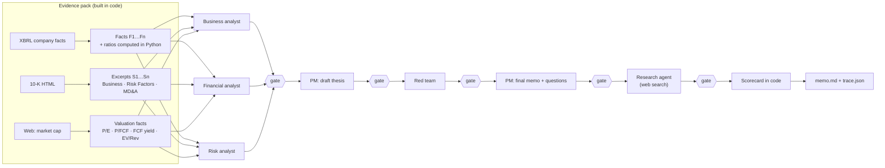

# due-diligence-agent

**An AI research team that reads a company's 10-K, researches open questions on the web, and writes an investment memo.**

```bash
ddagent NVDA COST ANET NKE BYND   # → memos/<TICKER>.md
```

Three specialist agents analyze the filing. A red-team agent attacks their thesis, and a PM agent writes the memo. A research agent then answers the PM's open questions with live web search. Every claim cites its evidence, and code rather than a prompt checks every citation and every number before the claim can move on. The verdict comes from a scorecard computed in code, not from the model's mood.

> Research triage, not investment advice.

## Results

Five real memos, generated September 2026:

| Company | Verdict (scorecard) | PM's own view | What the memo caught |
|---|---|---|---|
| [NVIDIA](memos/NVDA.md) | **Dig deeper** · 75% | Watch | Top marks on growth, margins and balance sheet, but 0/2 on valuation: a $5.45T market cap is a 1.8% FCF yield |
| [Costco](memos/COST.md) | **Dig deeper** · 71% | Watch | Thin-margin compounder (3.8% operating margin); research checked how past membership-fee hikes affected renewal rates and how much gasoline swings margins |
| [Arista](memos/ANET.md) | **Dig deeper** · 75% | Watch | Strong fundamentals; two customers (Microsoft 26%, Meta 16%) swing the story |
| [Nike](memos/NKE.md) | **Watch** · 46% | Dig deeper | Flat reported revenue is a 2% currency-neutral decline; cash conversion fell below net income |
| [Beyond Meat](memos/BYND.md) | **Pass** · 0% | Watch | Reported $219M net income came from a $548.7M debt-restructuring gain; operating loss $333.6M, operating cash burn $144.9M |

The scorecard and the PM disagree on every company, and that's useful information. The scorecard is mechanical and backward-looking: it reads the last fiscal year. The PM weighs the story, including turnarounds. The memo shows both, and it shows the scorecard line by line so a reader can see exactly where they disagree.

**Grounding across the five runs**

| | Passed the gate |
|---|---|
| Analyst, red-team and PM claims (evidence: 10-K facts and excerpts) | 195 / 206 (95%) |
| Research claims with web citations | 257 / 294 (87%) |
| Research sentences containing numbers but no citation | 0 / 85 (dropped by design) |

The research agent answered 30 of 30 diligence questions from cited public sources, so none were left for a human.

## How it works



1. **Evidence pack.** `edgar.py` pulls the latest 10-K and XBRL company facts from SEC EDGAR. `evidence.py` picks clean annual values: it drops restated quarters, keeps the latest restatement, and skips XBRL tags a company stopped using. It then computes margins, growth, CAGR, FCF, net debt and dilution **in Python**. `filing.py` extracts Business, Risk Factors and MD&A while skipping the table of contents.
2. **Valuation.** The research agent finds a cited market cap. Code computes P/E, P/FCF, FCF yield and EV/revenue from it.
3. **Specialists → PM draft → red team → PM final.** Every stage returns JSON claims with citations, and each claim goes through the gate before the next agent sees it. The red team attacks only claims that passed, and its own objections face the same check.
4. **Research agent.** It answers the PM's diligence questions with Anthropic's web search. The API truncates each quoted passage to about 150 characters, so `passages.py` fetches the page and recovers the full passage around the citation. Numbers are checked against what the page actually says, and anything the agent writes with a number but no citation is dropped.
5. **Scorecard** (`scorecard.py`). It scores growth, profitability, cash conversion, balance sheet, dilution and valuation from 0 to 2 each, minus 0.5 per high-severity red-team objection. Dig deeper is ≥65%, Watch ≥40%, and Pass <40%. Missing data counts as n/a rather than zero. Given the evidence, the only model-dependent input is the red-team penalty, capped at 2 points.

### The grounding gate (`verify.py`)

A claim survives only if every id it cites exists and **every number in it traces to the evidence it cites.**

- **Facts:** the number must equal the fact's value at the precision the writer used ("$4.4B" is checked to ±$0.05B), with unit scaling so $1.2B equals $1,200 million.
- **Ratios bind to their labels:** "6.6% YoY" can't be satisfied by a 6.6% CAGR that happens to be cited in the same claim.
- **Excerpts:** the number must appear in the passage as a whole number. "14" does not pass because "914" appears in the text.
- **No borrowing:** a number that's true but cited to the wrong evidence still fails.

## Measuring the gate

`eval/planted_errors.py` takes every claim that passed in the five real runs, corrupts it, and re-checks it. It makes no model calls, uses a fixed seed, and runs in CI.

| Corruption | Caught |
|---|---|
| Number nudged −20% / −10% / +15% / +50% | 593 / 607 (98%) |
| Citation swapped for other evidence (claims with numbers) | 297 / 305 (97%) |
| Citations removed | 440 / 440 (100%) |
| Citation to a non-existent id | 440 / 440 (100%) |
| Citation swapped on a qualitative claim (no numbers) | 0 / 135: **not detectable by design** |
| Control: unmodified claims still pass | 440 / 440 |

The gate checks numbers and ids, not meaning. A qualitative claim cited to the wrong passage gets through, and the table shows that openly because hiding it would defeat the point. Misses are listed in [`eval/RESULTS.md`](eval/RESULTS.md).

## How it got here

Each version was driven by what real runs exposed, and every fix has a regression test.

- **v0.1 → first real run (75% of claims passed).** Replaying every dropped claim showed that 20 of 30 drops were the verifier being wrong: "FY22" read as the number 22, a range dash read as a minus sign, and a flat rounding tolerance. Costco's em-dash headings ("Item 1A—Risk Factors") left it with a single excerpt. NVIDIA's and Arista's capex came from a tag they had stopped using years earlier, and the red team caught that one.
- **Planted-error eval.** It found two real holes: excerpt numbers were matched as substrings ("14" inside "914"), and ratios could borrow a same-valued number from a different metric. Both are fixed.
- **Web research.** The first version rejected true quotes because the API truncates cited passages, so the agent now recovers the full passage from the page. A live market-cap page had moved from $250.6B to $258.8B between search and verification, so the gate now accepts the number the model was shown or the one the page currently shows. It never accepts anything else.
- **Replay** (`scripts/replay.py`). Saved runs are re-graded with current code by feeding back the recorded model replies. This needs no API key, and it's how the numbers above were refreshed after the last fixes.

## Run it

```bash
pip install -e ".[dev]"
cp .env.example .env        # add ANTHROPIC_API_KEY and SEC_USER_AGENT="Your Name you@example.com"
ddagent AAPL MSFT           # add --no-research to skip web search
python scripts/replay.py memos/*.trace.json   # re-grade saved runs, no API calls
python eval/planted_errors.py
```

Each run writes `memos/<TICKER>.md` and a `trace.json` with the evidence pack, every raw model reply and the grounding report, so any memo can be audited end to end. EDGAR and web pages are cached in `.cache/`. A run makes about 7 model calls and about 15 web searches per company.

## Limitations

- The scorecard uses generic thresholds across industries (Costco's 3.8% operating margin would fail the margin test; it scores on ROE instead). It makes the triage transparent and repeatable, but it isn't the last word.
- It uses the 10-K plus web research. It doesn't read earnings-call audio, sell-side models or alternative data.
- The gate verifies provenance, not reasoning. A claim can cite correct numbers and still draw a weak conclusion, which is the gap the red team is there to cover.
- Filing excerpts are capped per section, so the long tail of risk factors isn't read.
- XBRL coverage is strongest for US operating companies. Banks and REITs use different line items.

## Layout

```
ddagent/edgar.py      SEC client (cache, rate limit, User-Agent)
ddagent/evidence.py   XBRL facts, derived ratios, valuation, evidence pack
ddagent/filing.py     10-K section extraction and chunking
ddagent/verify.py     the grounding gate
ddagent/agents.py     analysts, red team, PM; the pipeline
ddagent/research.py   web research agent (valuation + diligence questions)
ddagent/passages.py   recovers full passages behind truncated web citations
ddagent/scorecard.py  code-computed verdict
ddagent/render.py     Markdown memo
eval/                 planted-error eval
scripts/replay.py     re-grade saved runs without the model
tests/                offline tests: synthetic SEC fixtures + scripted model
```

MIT © Gavin Zeng
