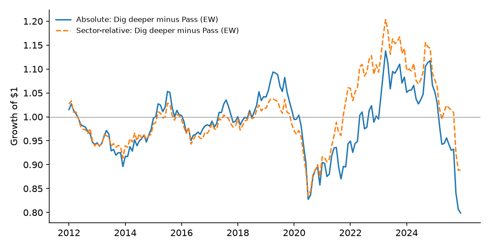
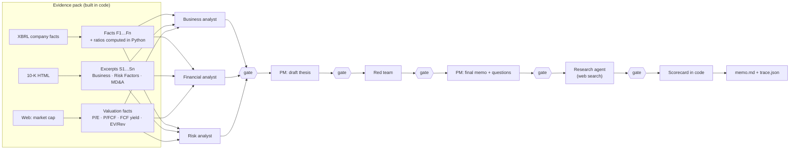

# due-diligence-agent

**An AI research team that reads a company's 10-K, researches open questions on the web, and writes an investment memo.**

```bash
ddagent NVDA COST ANET NKE BYND   # → memos/<TICKER>.md
```

Three specialist agents analyze the filing, a red-team agent attacks their thesis, and a PM agent writes the memo. A research agent then answers the PM's open questions with live web search. A scorecard turns the evidence into a verdict, and the memo shows exactly where the scorecard and the PM disagree.

Every verdict is also a prediction. The scorecard is backtested point-in-time on 14,514 company-years (2012–2025), and every live run is logged and graded against the market twelve months later.

> Research triage, not investment advice.

## Results

Five sample memos, generated September 2026:

| Company | Verdict (scorecard) | PM's own view | What the memo caught |
|---|---|---|---|
| [NVIDIA](memos/NVDA.md) | **Dig deeper** · 75% | Watch | Top marks on growth, margins and balance sheet, but 0/2 on valuation: a $5.45T market cap is a 1.8% FCF yield |
| [Costco](memos/COST.md) | **Dig deeper** · 71% | Watch | Thin-margin compounder (3.8% operating margin); research checked how past membership-fee hikes affected renewal rates and how much gasoline swings margins |
| [Arista](memos/ANET.md) | **Dig deeper** · 75% | Watch | Strong fundamentals; two customers (Microsoft 26%, Meta 16%) swing the story |
| [Nike](memos/NKE.md) | **Watch** · 46% | Dig deeper | Flat reported revenue is a 2% currency-neutral decline; cash conversion fell below net income |
| [Beyond Meat](memos/BYND.md) | **Pass** · 0% | Watch | Reported $219M net income came from a $548.7M debt-restructuring gain; operating loss $333.6M, operating cash burn $144.9M |

The scorecard and the PM disagree on every company, and that's useful information. The scorecard is mechanical and backward-looking: it reads the last fiscal year. The PM weighs the story, including turnarounds. The memo shows both, and it shows the scorecard line by line so a reader can see exactly where they disagree.

## Does the scorecard predict anything?

Every June 30 from 2012 to 2025, the same scorecard code scored every US-listed non-financial company worth at least $300M, using only the 10-K data public that day, then held each verdict group for twelve months. No model is involved. Full report: [`backtest/results/RESULTS.md`](backtest/results/RESULTS.md).

| | Dig deeper | Watch | Pass |
|---|---|---|---|
| Beat the median stock over the next 12 months | 53% | 50% | 46% |
| Return, value-weighted (annualized) | 17.5% | 16.4% | 12.6% |
| Return, equal-weighted (annualized) | 16.9% | 15.9% | 18.3% |

- **It ranks stocks, weakly.** The score's rank correlation with the next year's return averages 0.055 (t = 2.3) and is positive in 10 of 14 years.
- **It is not alpha.** Equal-weighted, Dig deeper minus Pass earns −1.3% a year, and −0.3% after the Fama-French five factors and momentum. The spread loads heavily on profitability (RMW 0.61, t = 7.8) and on larger companies. Value-weighted it earns 4.4% (alpha 6.6%, t = 1.4), which is not significant.
- **It loses in speculative rallies.** The spread fell sharply in 2020 and again from mid-2025.
- **Scoring against industry peers barely changes this** (rank correlation 0.049, equal-weighted alpha 0.4%).
- **Survivorship flatters Pass.** Prices come from today's listings. Among companies that later disappeared, 48% would have scored Pass, against 31% of survivors, so the missing losers make Pass look better than it was.



So the scorecard is a transparent quality screen, not a return forecast, and the memos now say so: each verdict is printed with its backtest track record. What the backtest cannot test is the agents. Whether the red team and the PM add anything the rubric misses is what the verdict ledger measures from here on.

## How it works


```mermaid
flowchart LR
    subgraph Evidence["Evidence pack (built in code)"]
        X[XBRL company facts] --> F["Facts F1…Fn<br/>+ ratios computed in Python"]
        K[10-K HTML] --> S["Excerpts S1…Sn<br/>Business · Risk Factors · MD&A"]
        V[Web: market cap] --> MC["Valuation facts<br/>P/E · P/FCF · FCF yield · EV/Rev"]
    end
    F & S & MC --> B[Business analyst] & FA[Financial analyst] & R[Risk analyst]
    B & FA & R --> G1{{gate}} --> PM1[PM: draft thesis] --> G2{{gate}}
    G2 --> RT[Red team] --> G3{{gate}} --> PM2[PM: final memo + questions] --> G4{{gate}}
    G4 --> RA["Research agent<br/>(web search)"] --> G5{{gate}}
    G5 --> SC[Scorecard in code] --> M[memo.md + trace.json]
```

1. **Evidence pack.** `edgar.py` pulls the latest 10-K and XBRL company facts from SEC EDGAR. `evidence.py` picks clean annual values: it drops restated quarters, keeps the latest restatement, and skips XBRL tags a company stopped using. It then computes margins, growth, CAGR, FCF, net debt and dilution **in Python**. `filing.py` extracts Business, Risk Factors and MD&A while skipping the table of contents.
2. **Valuation.** The research agent finds a cited market cap. Code computes P/E, P/FCF, FCF yield and EV/revenue from it.
3. **Specialists → PM draft → red team → PM final.** Every stage returns JSON claims with citations, and each claim goes through the gate before the next agent sees it. The red team attacks only claims that passed, and its own objections face the same check.
4. **Research agent.** It answers the PM's diligence questions with Anthropic's web search. The API truncates each quoted passage to about 150 characters, so `passages.py` fetches the page and recovers the full passage around the citation. Numbers are checked against what the page actually says, and anything the agent writes with a number but no citation is dropped.
5. **Scorecard** (`scorecard.py`). It scores growth, profitability, cash conversion, balance sheet, dilution and valuation from 0 to 2 each, minus 0.5 per high-severity red-team objection. Dig deeper is ≥65%, Watch ≥40%, and Pass <40%. Missing data counts as n/a rather than zero. Given the evidence, the only model-dependent input is the red-team penalty, capped at 2 points. The memo also scores the same dimensions against the company's industry peers (top, middle or bottom third of its SIC industry, from the backtest's peer tables), so a retailer isn't judged by a software company's margins.
6. **Ledger** (`ledger.py`). Each run appends the scorecard verdict, the peer-relative verdict and the PM's view to `ledger.jsonl` with a twelve-month horizon. `ddagent-grade` scores entries that have come due against SPY, including who was right when the scorecard and the PM disagreed.

### The grounding gate (`verify.py`)

A claim survives only if every id it cites exists and **every number in it traces to the evidence it cites.**

- **Facts:** the number must equal the fact's value at the precision the writer used ("$4.4B" is checked to ±$0.05B), with unit scaling so $1.2B equals $1,200 million.
- **Ratios bind to their labels:** "6.6% YoY" can't be satisfied by a 6.6% CAGR that happens to be cited in the same claim.
- **Excerpts:** the number must appear in the passage as a whole number. "14" does not pass because "914" appears in the text.
- **No borrowing:** a number that's true but cited to the wrong evidence still fails.

## Measuring the gate

`eval/planted_errors.py` takes every claim that passed in the five runs, corrupts it, and re-checks it. It makes no model calls, uses a fixed seed, and runs in CI.

| Corruption | Caught |
|---|---|
| Number nudged −20% / −10% / +15% / +50% | 593 / 607 (98%) |
| Citation swapped for other evidence (claims with numbers) | 297 / 305 (97%) |
| Citations removed | 440 / 440 (100%) |
| Citation to a non-existent id | 440 / 440 (100%) |
| Citation swapped on a qualitative claim (no numbers) | 0 / 135: **not detectable by design** |
| Control: unmodified claims still pass | 440 / 440 |

The gate checks numbers and ids, not meaning. A qualitative claim cited to the wrong passage gets through, and the table shows that openly because hiding it would defeat the point. Misses are listed in [`eval/RESULTS.md`](eval/RESULTS.md).

## Run it

```bash
pip install -e ".[dev]"
cp .env.example .env        # add ANTHROPIC_API_KEY and SEC_USER_AGENT="Your Name you@example.com"
ddagent AAPL MSFT           # add --no-research to skip web search
python scripts/replay.py memos/*.trace.json   # re-grade saved runs, no API calls
python eval/planted_errors.py
ddagent-grade               # score logged verdicts that have come due

pip install -e ".[backtest]"
python -m backtest          # ~1.4 GB SEC download on first run, then about 30 minutes
```

Each run writes `memos/<TICKER>.md` and a `trace.json` with the evidence pack, every raw model reply and the grounding report, so any memo can be audited end to end. EDGAR and web pages are cached in `.cache/`. A run makes about 7 model calls and about 15 web searches per company.

## Limitations

- The scorecard is a quality screen. The backtest shows it ranks stocks weakly and earns nothing beyond known factors, so a Dig deeper verdict means "worth an analyst's time", not "will outperform".
- The backtest uses prices for companies listed today, so it can't include companies that were later delisted.
- It uses the 10-K plus web research. It doesn't read earnings-call audio, sell-side models or alternative data.
- The gate verifies provenance, not reasoning. A claim can cite correct numbers and still draw a weak conclusion, which is the gap the red team is there to cover.
- Filing excerpts are capped per section, so the long tail of risk factors isn't read.
- XBRL coverage is strongest for US operating companies. Banks and REITs use different line items.

## Layout

```
ddagent/edgar.py      SEC client (cache, rate limit, User-Agent)
ddagent/evidence.py   XBRL facts, derived ratios, valuation, evidence pack
ddagent/filing.py     10-K section extraction and chunking
ddagent/verify.py     the grounding gate
ddagent/agents.py     analysts, red team, PM; the pipeline
ddagent/research.py   web research agent (valuation + diligence questions)
ddagent/passages.py   recovers full passages behind truncated web citations
ddagent/scorecard.py  code-computed verdict, absolute and against industry peers
ddagent/render.py     Markdown memo
ddagent/pit.py        point-in-time view of SEC facts (only what was filed by a date)
ddagent/prices.py     monthly prices, split-aware
ddagent/ledger.py     verdict log and grading
backtest/             point-in-time backtest: data, scoring panel, portfolios, factor regressions
eval/                 planted-error eval
scripts/replay.py     re-grade saved runs without the model
tests/                offline tests: synthetic SEC fixtures + scripted model
```

MIT © Gavin Zeng
